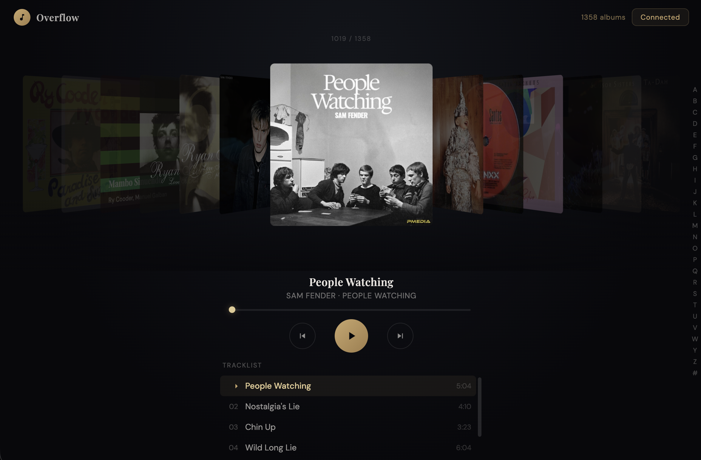

# Overflow

A Cover Flow music player for Plex. Browse your album collection with the classic Apple Cover Flow interface — spring-physics scrolling, real album art, alphabet scrubber, and full audio playback.



## Quick start

```bash
npm install
npm run dev
```

Opens at http://localhost:5173. Use arrow keys, scroll wheel, drag, or the alphabet strip on the right to browse albums.

## Connecting to Plex

1. Click **Connect Plex** in the top right
2. Enter your Plex server URL (e.g. `192.168.1.10:32400`)
3. Enter your X-Plex-Token (instructions are in the modal)
4. Click **Connect**

Your credentials are saved to `localStorage` and reconnect automatically on next load.

## Features

- Spring-physics Cover Flow carousel with momentum scrolling
- Drag, scroll wheel, and keyboard navigation
- Real Plex album art and tracklists
- Audio playback via HTML5 Audio
- A–Z alphabet scrubber for large libraries (drag to jump)
- Albums sorted alphabetically by artist

## Dev notes

The app runs against a local Plex server over HTTP via a Vite dev proxy (`/plex-proxy`), which sidesteps browser cross-origin restrictions without needing CORS changes on the server.